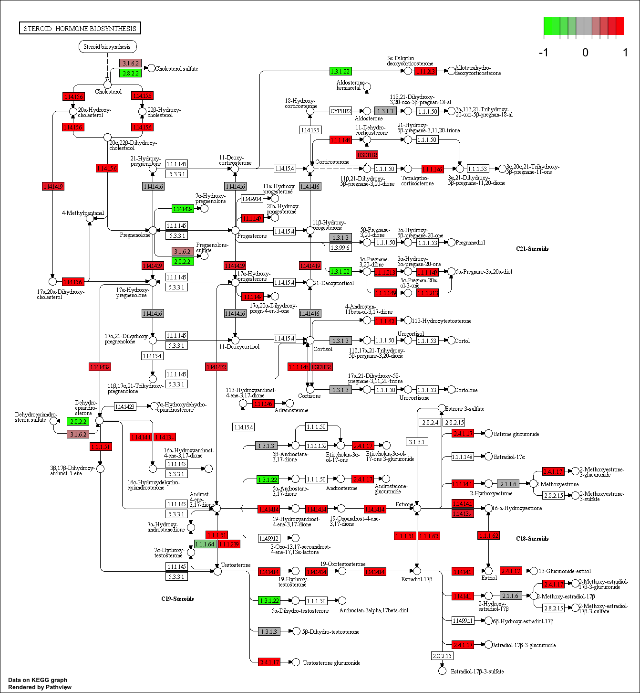

```{r setup, include=FALSE}
knitr::opts_chunk$set(echo = TRUE)
```

```{r}
library(DESeq2)
```

##Section 1 - Differential Expression Analysis

```{r}
metaFile <- "GSE37704_metadata.csv"
countFile <- "GSE37704_featurecounts.csv"
```

```{r}
# Import metadata and take a peek
colData = read.csv(metaFile, row.names=1)
head(colData)
```

```{r}
# Import countdata
countData = read.csv(countFile, row.names=1)
head(countData)
```
We need to remove that first **length** column from the countData
```{r}
# Note we need to remove the odd first $length col
countData <- as.matrix(countData[,-1])
head(countData)
```


```{r}
# Filter count data where you have 0 read count across all samples.

nonzero.inds <- rowSums(countData)!= 0
countData <- countData[nonzero.inds,]
head(countData)

```

```{r}
dds = DESeqDataSetFromMatrix(countData=countData, colData=colData, design=~condition)
```

```{r}
dds = DESeq(dds)
```

```{r}
dds
res = results(dds)
```

```{r}
summary(res)
```

```{r}
mycols <- rep("gray", nrow(res) )
plot(res$log2FoldChange, -log(res$padj), col = mycols )

abline(h=-log(0.05), col = "green")
abline(v=c(-2,2), col = "green")
```

```{r}
# Make a color vector for all genes
#We are replicating the command of turning all the points of the rows of res to gray and assigning the name of "mycols"
mycols <- rep("gray", nrow(res) )

# Color red the genes with absolute fold change above 2
#Here we are selecting the log2FoldChange column of the results and taking its absolute value.  When this is greater than two within "mycols", this will change these points to red
mycols[abs(res$log2FoldChange) > 2 ] <- "red"

# Color blue those with adjusted p-value less than 0.01 and absolute fold change more than 2
#Same idea as above but we are assigning the conditions to a variable for ease.  We then are commanding R to change all of the points which match the paramaters of "inds" within mycols to blue
inds <- res$padj<0.01 & (abs(res$log2FoldChange) > 2 )
mycols[ inds ] <- "blue"

#We then are plotting this - (x axis, y axis, color assignments, x labels, y labels)
plot( res$log2FoldChange, -log(res$padj), col=mycols, xlab="Log2(FoldChange)", ylab="-Log(P-value)" )

abline(h=-log(0.05), col = "green")
abline(v=c(-2,2), col = "green")
```


```{r}
library("AnnotationDbi")
library("org.Hs.eg.db")

columns(org.Hs.eg.db)
```

```{r}
res$symbol = mapIds(org.Hs.eg.db,
                    keys=row.names(res), 
                    keytype="ENSEMBL",
                    column="SYMBOL",
                    multiVals="first")
res$entrez = mapIds(org.Hs.eg.db,
                    keys=row.names(res),
                    keytype="ENSEMBL",
                    column="ENTREZID",
                    multiVals="first")

res$name =   mapIds(org.Hs.eg.db,
                    keys=row.names(res),
                    keytype="ENSEMBL",
                    column="GENENAME",
                    multiVals="first")

head(res, 10)

```

```{r}
res = res[order(res$pvalue),]
write.csv(res, file="deseq_results.csv")
```

# Run in your R console (i.e. not your Rmarkdown doc!)
BiocManager::install( c("pathview", "gage", "gageData") )

# For old vesrsions of R only (R < 3.5.0)!
#source("http://bioconductor.org/biocLite.R")
#biocLite( c("pathview", "gage", "gageData") )
```{r}
library(pathview)
library(gage)
library(gageData)
```


```{r}
data(kegg.sets.hs)
data(sigmet.idx.hs)

# Focus on signaling and metabolic pathways only
kegg.sets.hs = kegg.sets.hs[sigmet.idx.hs]

# Examine the first 3 pathways
head(kegg.sets.hs, 3)
```

The **gage** package wants a vector as input with our numeric scores of interest with the vector names being ENTREZID
```{r}
foldchanges = res$log2FoldChange
names(foldchanges) = res$entrez
head(foldchanges)
```

```{r}
# Get the results
keggres = gage(foldchanges, gsets=kegg.sets.hs)

```

```{r}
attributes(keggres)
```

```{r}
# Look at the first few down (less) pathways
head(keggres$less)
```

```{r}
pathview(gene.data=foldchanges, pathway.id="hsa04110")
```


```{r}
# A different PDF based output of the same data
pathview(gene.data=foldchanges, pathway.id="hsa04110", kegg.native=FALSE)
```

```{r}
## Focus on top 5 upregulated pathways here for demo purposes only
keggrespathways <- rownames(keggres$greater)[1:5]

# Extract the 8 character long IDs part of each string
keggresids = substr(keggrespathways, start=1, stop=8)
keggresids
```

###Finally, lets pass these IDs in keggresids to the pathview() function to draw plots for all the top 5 pathways.
```{r}
pathview(gene.data=foldchanges, pathway.id=keggresids, species="hsa")
```





##Section 3 - GO Onotology

```{r}
data(go.sets.hs)
data(go.subs.hs)

# Focus on Biological Process subset of GO
gobpsets = go.sets.hs[go.subs.hs$BP]

gobpres = gage(foldchanges, gsets=gobpsets, same.dir=TRUE)

lapply(gobpres, head)
```

##Section 4 - Reactome Analysis

```{r}
sig_genes <- res[res$padj <= 0.05 & !is.na(res$padj), "symbol"]
print(paste("Total number of significant genes:", length(sig_genes)))
```


```{r}
write.table(sig_genes, file="significant_genes.txt", row.names=FALSE, col.names=FALSE, quote=FALSE)
```


