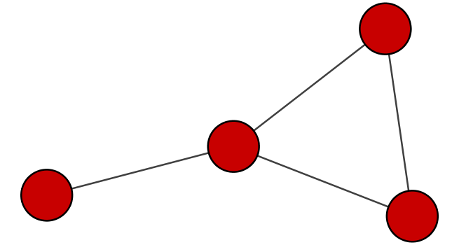
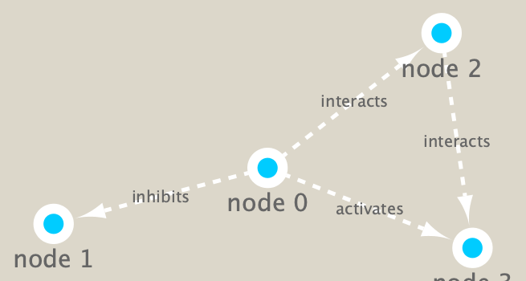

```{r setup, include=FALSE}
knitr::opts_chunk$set(echo = TRUE)
```

#Load the required packages **RCy3** from bioconductor and **igraph** from CRAN
###install.packages("igraph")
###BiocManager::install("RCy3")

```{r}
library(igraph)
library(RColorBrewer)
library(RCy3)
```


```{r}
#Test connection to Cytoscape 
cytoscapePing()
#Test the version
cytoscapeVersionInfo()
```

```{r}
g <- makeSimpleIgraph()
createNetworkFromIgraph(g,"myGraph")
```

```{r}
fig <- exportImage(filename="demo", type="png", height=350)

```

```{r}
setVisualStyle("Marquee")
```

```{r}
fig <- exportImage(filename="demo_marquee", type="png", height=350)


```

```{r}
styles <- getVisualStyleNames()
styles
```

```{r}
plot(g)
```


```{r}
## scripts for processing located on class website"
pork_vir_cor <- read.delim("./virus_prok_cor_abundant.tsv", stringsAsFactors = FALSE)

## Have a peek at the first 6 rows
head(pork_vir_cor)
```

###How many edges will we have?
```{r}
nrow(pork_vir_cor)
```

###How many unique species are there?
```{r}
length(unique(c(pork_vir_cor[,1]), pork_vir_cor[,2]))

```

```{r}
g <- graph.data.frame(pork_vir_cor, directed = FALSE)
class(g)
g
```

```{r}
plot(g)
plot(g, vertex.label=NA)
plot(g, vertex.size=3, vertex.label=NA)
```

```{r}
library(ggplot2)
library(ggraph)
```

```{r}
ggraph(g, layout = 'auto') +
  geom_edge_link(alpha = 0.25) +
  geom_node_point(color="steelblue") +
  theme_graph()
## Using `nicely` as default layout
```

```{r}
createNetworkFromIgraph(g,"myIgraph")
```

##Let's calculate some things ;-)
```{r}
V(g)
E(g)
```

Community detection with the Girvin Newman:
```{r}
cb <- cluster_edge_betweenness(g)
cb
```

```{r}
plot(cb, y=g, vertex.label=NA,  vertex.size=3)
```

#You can extract a cluster/community membership vector for further inspection with the membership() function:

```{r}
head( membership(cb) )
```

```{r}
# Calculate and plot node degree of our network
d <- degree(g)
hist(d, breaks=30, col="lightblue", main ="Node Degree Distribution")
```

```{r}
plot( degree_distribution(g), type="h" )
```

```{r}
#Centrality analysis often aims to answer the following question: Which nodes are the most important and why? One centrality method that you can often find in publications is the Google PageRank score. 

pr <- page_rank(g)
head(pr$vector)
```

###install.packages("BBmisc")
```{r}
# Make a size vector btwn 2 and 20 for node plotting size

v.size <- BBmisc::normalize(pr$vector, range=c(2,20), method="range")
plot(g, vertex.size=v.size, vertex.label=NA)
```

```{r}
v.size <- BBmisc::normalize(d, range=c(2,20), method="range")
plot(g, vertex.size=v.size, vertex.label=NA)
```

```{r}
b <- betweenness(g)
v.size <- BBmisc::normalize(b, range=c(2,20), method="range")
plot(g, vertex.size=v.size, vertex.label=NA)
```

```{r}
phage_id_affiliation <- read.delim("./phage_ids_with_affiliation.tsv")
head(phage_id_affiliation)
```

```{r}
bac_id_affi <- read.delim("./prok_tax_from_silva.tsv", stringsAsFactors = FALSE)
head(bac_id_affi)
```

```{r}
## Extract out our vertex names
genenet.nodes <- as.data.frame(vertex.attributes(g), stringsAsFactors=FALSE)
head(genenet.nodes)
```

```{r}
length( grep("^ph_",genenet.nodes[,1]) )
```

```{r}

```

```{r}
# We dont need all annotation data so lets make a reduced table 'z' for merging
z <- bac_id_affi[,c("Accession_ID", "Kingdom", "Phylum", "Class")]
n <- merge(genenet.nodes, z, by.x="name", by.y="Accession_ID", all.x=TRUE)
head(n)
```

```{r}
# Check on the column names before deciding what to merge
colnames(n)
```

```{r}
colnames(phage_id_affiliation)
```

```{r}
# Again we only need a subset of `phage_id_affiliation` for our purposes
y <- phage_id_affiliation[, c("first_sheet.Phage_id_network", "phage_affiliation","Tax_order", "Tax_subfamily")]

# Add the little phage annotation that we have
x <- merge(x=n, y=y, by.x="name", by.y="first_sheet.Phage_id_network", all.x=TRUE)

## Remove duplicates from multiple matches
x <- x[!duplicated( (x$name) ),]
head(x)
```

```{r}
genenet.nodes <- x
```

##Send network to Cytoscape using RCy3
##deleteAllNetworks() if there is anything else open in Cytoscape to preserve memory - save opened networks if you wish to keep them
```{r}
# Open a new connection and delete any existing windows/networks in Cy
# Set the main nodes colname to the required "id" 
colnames(genenet.nodes)[1] <- "id"
```

```{r}
genenet.edges <- data.frame(igraph::as_edgelist(g))

# Set the main edges colname to the required "source" and "target" 
colnames(genenet.edges) <- c("source","target")

# Add the weight from igraph to a new column...
genenet.edges$Weight <- igraph::edge_attr(g)$weight

# Send as a new network to Cytoscape
createNetworkFromDataFrames(genenet.nodes,genenet.edges, 
                            title="Tara_Oceans")
```

