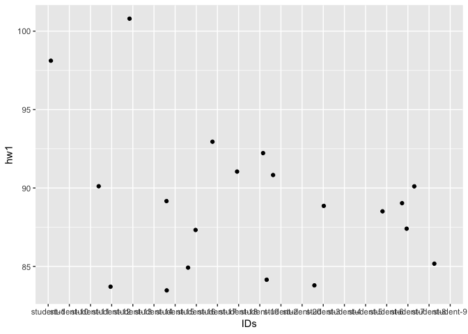
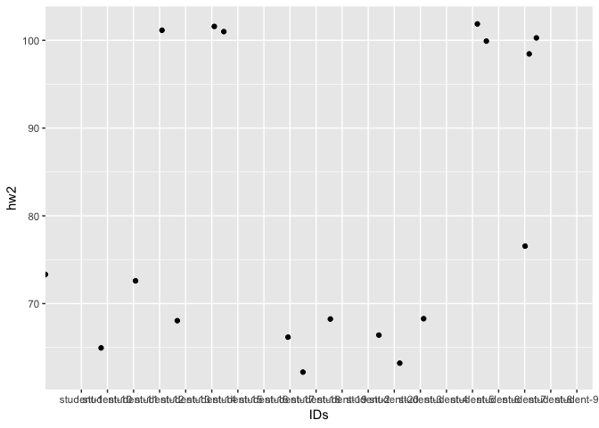

lecture\_7\_class\_walkthrough
================
LQ
4/24/2019

More on function writing
------------------------

First we will revisit our function from last day
------------------------------------------------

``` r
source("http://tinyurl.com/rescale-R")
```

``` r
library(ggplot2)
```

Test rescale function

``` r
str(rescale)
```

    ## function (x, na.rm = TRUE, plot = FALSE, ...)

``` r
rescale(1:10)
```

    ##  [1] 0.0000000 0.1111111 0.2222222 0.3333333 0.4444444 0.5555556 0.6666667
    ##  [8] 0.7777778 0.8888889 1.0000000

``` r
x <- c(1:10, "string")
!is.numeric(x)
```

    ## [1] TRUE

Function practice
-----------------

Write a function to identify NA elements in two vectors Start with a simple example input where I know what the answer shuld be.

``` r
x <- c( 1, 2, NA, 3, NA) 
y <- c(NA, 3, NA, 3, 4)

is.na(x)
```

    ## [1] FALSE FALSE  TRUE FALSE  TRUE

``` r
is.na(y)
```

    ## [1]  TRUE FALSE  TRUE FALSE FALSE

I am looking for the positions where it is TRUE in both vectors

``` r
is.na(x) & is.na(y)
```

    ## [1] FALSE FALSE  TRUE FALSE FALSE

Use sum to find out how many trues there are

``` r
sum(is.na(x) & is.na(y))
```

    ## [1] 1

THIS IS MY WORKING SNIPPET OF CODE

``` r
both_na <- function(x,y) {
  sum(is.na(x) & is.na(y))
}
```

``` r
both_na(x,y)
```

    ## [1] 1

``` r
both_na(c(NA, NA, NA), c(NA, NA,1))
```

    ## [1] 2

``` r
both_na(c(NA, NA, NA), c(1, NA, NA, NA))
```

    ## Warning in is.na(x) & is.na(y): longer object length is not a multiple of
    ## shorter object length

    ## [1] 3

It gives back a number because R is recycling the vector so going back to the beginning of the shorter vector to make the "n's" the same

``` r
both_na(c(NA, NA, NA), c(1, NA, NA, NA, NA, NA))
```

    ## [1] 5

Check the length of our inputs are equal

``` r
x<- c(NA, NA, NA)
y <-c(1, NA, NA, NA, NA, NA)
length(x) != length(y)
```

    ## [1] TRUE

``` r
both_na3 <- function(x, y) {
  ## Check for NA elements in both input vectors and don't allow re-cycling 
  if(length(x) != length(y)) {
    stop("Input x and y should be vectors of the same length", call.=FALSE)
  }
  sum( is.na(x) & is.na(y) )
}
```

Try theboth\_na3() function with extra features

``` r
x <- c(1, 2, NA, 3, NA)
y <- c(NA, 3, NA, 3, NA)
both_na3(x,y)
```

    ## [1] 2

``` r
x <- c(100, 100, 100, 100, 100, 100, 100, 90)
(sum(x)-min(x)) / (length(x)-1)
```

    ## [1] 100

``` r
y <- c(100, NA, 90, 90, 90, 90, 97, 80)
mean(y, na.rm = TRUE)
```

    ## [1] 91

``` r
x <- c(100, 100, 100, 100, 100, 100, 100, 90)
(sum(x)-min(x)) / (length(x)-1)
```

    ## [1] 100

``` r
y <- c(100, NA, 90, 90, 90, 90, 97, 80)
mean(y, na.rm = TRUE)
```

    ## [1] 91

``` r
grade <- function(x) {
  (sum(x)-min(x)) / (length(x)-1)
}
grade(x)
```

    ## [1] 100

``` r
grade_2 <- function(y) {
  (sum(y, na.rm = T)-min(y, na.rm = T)) / (length(y)-1)
}
grade_2(y)
```

    ## [1] 79.57143

``` r
y <- c(100, NA, 90, 90, 90, 90, 97, 80)
grade_2 <- function(y) {
  (sum(y,na.rm = T)-min(y, na.rm = T))/(length(y)-1)
}
grade_2(y)
```

    ## [1] 79.57143

``` r
url <- "https://tinyurl.com/gradeinput"
students<- read.csv(url, row.names = 1)
head(students)
```

    ##           hw1 hw2 hw3 hw4 hw5
    ## student-1 100  73 100  88  79
    ## student-2  85  64  78  89  78
    ## student-3  83  69  77 100  77
    ## student-4  88  NA  73 100  76
    ## student-5  88 100  75  86  79
    ## student-6  89  78 100  89  77

``` r
grade_2(students[5,])
```

    ## [1] 88.25

``` r
ans<-apply(students, 1, grade_2)
ans
```

    ##  student-1  student-2  student-3  student-4  student-5  student-6 
    ##      91.75      82.50      84.25      66.00      88.25      89.00 
    ##  student-7  student-8  student-9 student-10 student-11 student-12 
    ##      94.00      93.75      87.75      61.00      86.00      91.75 
    ## student-13 student-14 student-15 student-16 student-17 student-18 
    ##      92.25      87.75      62.50      89.50      88.00      72.75 
    ## student-19 student-20 
    ##      82.75      82.75

``` r
sort(ans, decreasing = FALSE)
```

    ## student-10 student-15  student-4 student-18  student-2 student-19 
    ##      61.00      62.50      66.00      72.75      82.50      82.75 
    ## student-20  student-3 student-11  student-9 student-14 student-17 
    ##      82.75      84.25      86.00      87.75      87.75      88.00 
    ##  student-5  student-6 student-16  student-1 student-12 student-13 
    ##      88.25      89.00      89.50      91.75      91.75      92.25 
    ##  student-8  student-7 
    ##      93.75      94.00

FINDING THE INTERSECTION BETWEEN 2 VECTORS

``` r
source("http://tinyurl.com/rescale-R")
df1
```

    ##     IDs exp
    ## 1 gene1   2
    ## 2 gene2   1
    ## 3 gene3   1

``` r
df2
```

    ##     IDs exp
    ## 1 gene2  -2
    ## 2 gene4  NA
    ## 3 gene3   1
    ## 4 gene5   2

``` r
x<-df1$IDs
y<-df2$IDs

intersect(x,y)
```

    ## [1] "gene2" "gene3"

``` r
x
```

    ## [1] "gene1" "gene2" "gene3"

``` r
y
```

    ## [1] "gene2" "gene4" "gene3" "gene5"

``` r
x %in% y
```

    ## [1] FALSE  TRUE  TRUE

``` r
x[x %in% y]
```

    ## [1] "gene2" "gene3"

``` r
cbind( x[ x %in% y ], 
       y[ y %in% x ] )
```

    ##      [,1]    [,2]   
    ## [1,] "gene2" "gene2"
    ## [2,] "gene3" "gene3"

``` r
gene_intersect <- function(x, y) {
  cbind( x[ x %in% y ], y[ y %in% x ] )
}
```

``` r
gene_intersect(x,y)
```

    ##      [,1]    [,2]   
    ## [1,] "gene2" "gene2"
    ## [2,] "gene3" "gene3"

``` r
gene_intersect2 <- function(df1, df2) { 
   cbind( df1[ df1$IDs %in% df2$IDs, ], 
          df2[ df2$IDs %in% df1$IDs, "exp"] )
}

gene_intersect2(df1, df2)
```

    ##     IDs exp df2[df2$IDs %in% df1$IDs, "exp"]
    ## 2 gene2   1                               -2
    ## 3 gene3   1                                1

``` r
gene_intersect4 <- function(df1, df2, gene.colname="IDs") { 

  df1.name <- df1[,gene.colname]
  df2.name <- df2[,gene.colname]

  df1.inds <- df1.name %in% df2.name
  df2.inds <- df2.name %in% df1.name

   cbind( df1[ df1.inds, ], 
          exp2=df2[ df2.inds, "exp"] )
}

gene_intersect4(df1, df2)
```

    ##     IDs exp exp2
    ## 2 gene2   1   -2
    ## 3 gene3   1    1

``` r
merge(df1, df2, by="IDs")
```

    ##     IDs exp.x exp.y
    ## 1 gene2     1    -2
    ## 2 gene3     1     1

``` r
students$IDs <- rownames(students)

ggplot(students, aes(IDs, hw1)) + geom_jitter(height = 2, width = 2)
```



``` r
ggplot(students, aes(IDs, hw2)) + geom_jitter(height = 2, width = 2)
```

    ## Warning: Removed 2 rows containing missing values (geom_point).


