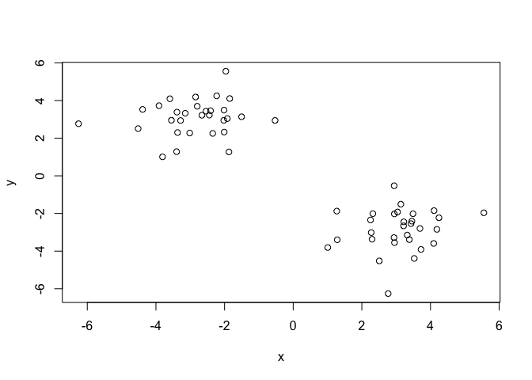
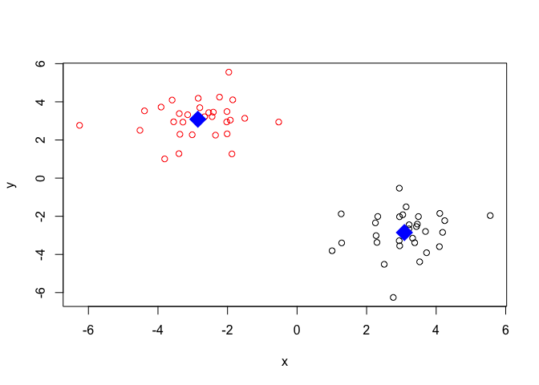
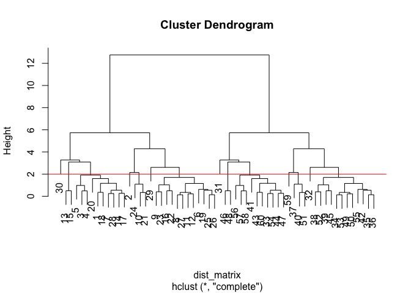
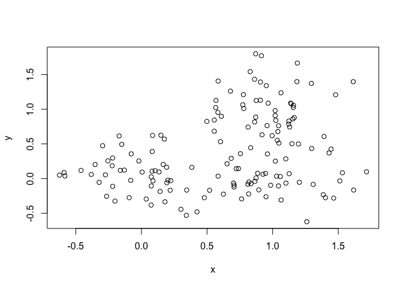
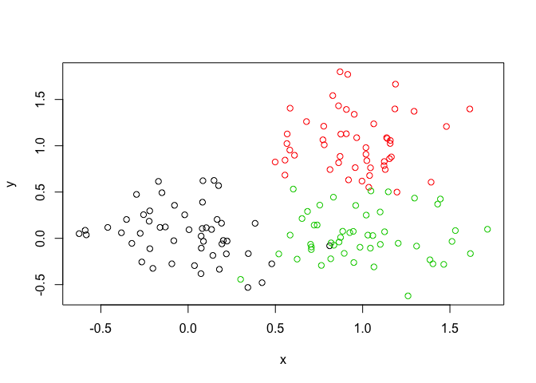
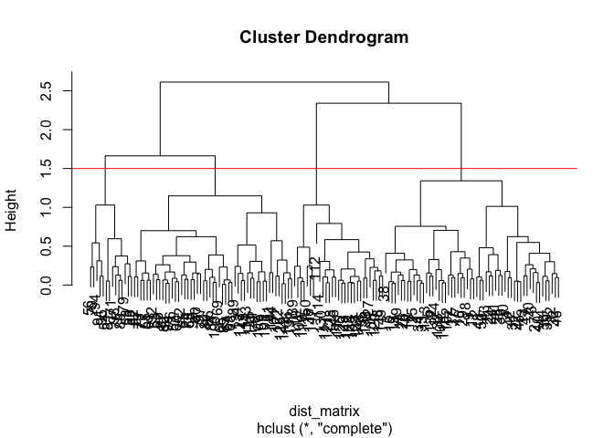
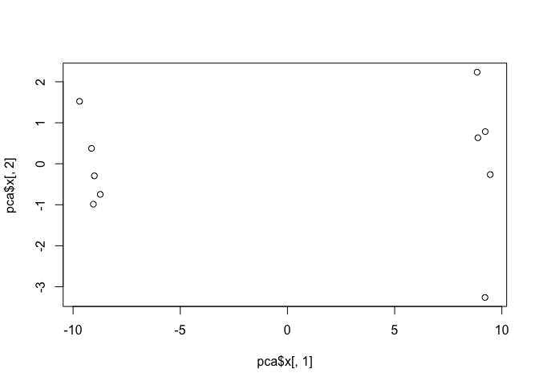
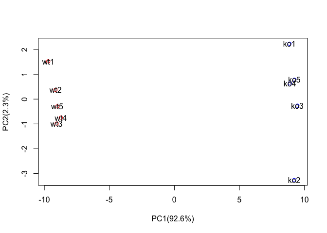
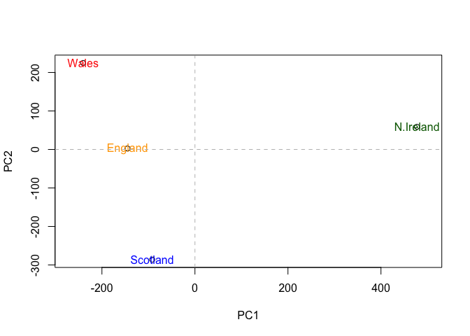
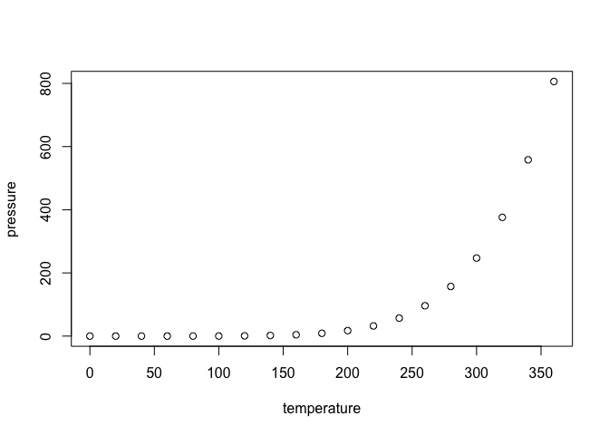

lecture\_8\_class\_walkthrough
================
LQ
4/26/2019

Kmeans clustering
-----------------

Let's try out the **kmeans()** function in R with some madeup data

``` r
# Generate some example data for clustering
tmp <- c(rnorm(30,-3), rnorm(30,3))
x <- cbind(x=tmp, y=rev(tmp))
plot(x)
```



``` r
km <- kmeans(x, centers = 2, 20)
km
```

    ## K-means clustering with 2 clusters of sizes 30, 30
    ## 
    ## Cluster means:
    ##           x         y
    ## 1  3.086275 -2.852509
    ## 2 -2.852509  3.086275
    ## 
    ## Clustering vector:
    ##  [1] 2 2 2 2 2 2 2 2 2 2 2 2 2 2 2 2 2 2 2 2 2 2 2 2 2 2 2 2 2 2 1 1 1 1 1
    ## [36] 1 1 1 1 1 1 1 1 1 1 1 1 1 1 1 1 1 1 1 1 1 1 1 1 1
    ## 
    ## Within cluster sum of squares by cluster:
    ## [1] 61.24092 61.24092
    ##  (between_SS / total_SS =  89.6 %)
    ## 
    ## Available components:
    ## 
    ## [1] "cluster"      "centers"      "totss"        "withinss"    
    ## [5] "tot.withinss" "betweenss"    "size"         "iter"        
    ## [9] "ifault"

``` r
km$cluster
```

    ##  [1] 2 2 2 2 2 2 2 2 2 2 2 2 2 2 2 2 2 2 2 2 2 2 2 2 2 2 2 2 2 2 1 1 1 1 1
    ## [36] 1 1 1 1 1 1 1 1 1 1 1 1 1 1 1 1 1 1 1 1 1 1 1 1 1

``` r
table(km$cluster)
```

    ## 
    ##  1  2 
    ## 30 30

``` r
km$centers
```

    ##           x         y
    ## 1  3.086275 -2.852509
    ## 2 -2.852509  3.086275

``` r
plot(x, col=km$cluster)
points(km$centers, col = "blue", pch = 18, cex = 3)
```



``` r
# First we need to calculate point (dis)similarity
#   as the Euclidean distance between observations
dist_matrix <- dist(x)
# The hclust() function returns a hierarchical
#  clustering model
hc <- hclust(d = dist_matrix)
# the print method is not so useful here
hc
```

    ## 
    ## Call:
    ## hclust(d = dist_matrix)
    ## 
    ## Cluster method   : complete 
    ## Distance         : euclidean 
    ## Number of objects: 60

``` r
plot(hc)
cutree(hc, k=6)
```

    ##  [1] 1 2 1 1 1 3 1 3 3 2 3 3 1 1 1 3 1 1 3 1 2 3 3 2 3 3 3 1 3 1 4 5 4 5 5
    ## [36] 5 6 5 5 6 4 5 4 4 5 4 4 4 5 5 6 5 5 4 5 4 4 4 6 4

``` r
abline(h=2, col=2)
```



``` r
# Step 1. Generate some example data for clustering
x <- rbind(
  matrix(rnorm(100, mean=0, sd = 0.3), ncol = 2),   # c1
  matrix(rnorm(100, mean = 1, sd = 0.3), ncol = 2), # c2
  matrix(c(rnorm(50, mean = 1, sd = 0.3),           # c3
           rnorm(50, mean = 0, sd = 0.3)), ncol = 2))
colnames(x) <- c("x", "y")
# Step 2. Plot the data without clustering
plot(x)
```



``` r
# Step 3. Generate colors for known clusters
#         (just so we can compare to hclust results)
col <- as.factor( rep(c("c1","c2","c3"), each=50) )
plot(x, col=col)
```



``` r
#Q. Use the dist(), hclust(), plot() and cutree() functions to return 2 and 3 clusters
dist_matrix <- dist(x)
hc <- hclust(d = dist_matrix)
plot(hc)
cutree(hc, k = 3)
```

    ##   [1] 1 1 1 1 1 1 1 1 1 1 1 1 1 1 1 1 1 1 1 1 1 1 2 1 1 1 1 1 1 1 1 1 1 1 1
    ##  [36] 1 1 1 1 1 1 1 1 1 1 1 1 1 1 1 3 3 3 3 3 3 3 3 3 3 3 3 3 3 3 3 3 3 3 3
    ##  [71] 3 3 3 3 3 3 3 3 3 3 3 3 3 3 3 3 3 3 3 3 3 3 3 3 3 3 3 3 3 3 3 1 3 2 2
    ## [106] 3 3 2 1 2 2 2 1 2 1 3 2 2 2 2 2 3 3 1 2 3 2 2 2 2 3 1 1 3 2 2 2 2 2 2
    ## [141] 3 3 3 3 3 2 2 2 2 2

``` r
abline(h=1.5, col = 2)
```



``` r
gp2 <- cutree(hc, k=2)
gp3 <- cutree(hc, k=3)
 
table(gp2)
```

    ## gp2
    ##  1  2 
    ## 85 65

``` r
table(gp3)
```

    ## gp3
    ##  1  2  3 
    ## 56 29 65

``` r
#NEED TO FIX - plot(x,gp3)
#Q. How does this compare to your known 'col' groups
```

PCA
---

``` r
?prcomp
mydata <- read.csv("https://tinyurl.com/expression-CSV",
row.names=1)
head(mydata)
```

    ##        wt1 wt2  wt3  wt4 wt5 ko1 ko2 ko3 ko4 ko5
    ## gene1  439 458  408  429 420  90  88  86  90  93
    ## gene2  219 200  204  210 187 427 423 434 433 426
    ## gene3 1006 989 1030 1017 973 252 237 238 226 210
    ## gene4  783 792  829  856 760 849 856 835 885 894
    ## gene5  181 249  204  244 225 277 305 272 270 279
    ## gene6  460 502  491  491 493 612 594 577 618 638

``` r
length(mydata)
```

    ## [1] 10

Backticks will make the line show up in the knitted document
------------------------------------------------------------

There are `nrow(mydata)` genes in this dataset

``` r
pca <- prcomp(t(mydata), scale = TRUE)
##scale will keep all of the columns to be treated equally
##t transposed the data (necessary for the data to be processed - flipping the x and y axes)
summary(pca)
```

    ## Importance of components:
    ##                           PC1    PC2     PC3     PC4     PC5     PC6
    ## Standard deviation     9.6237 1.5198 1.05787 1.05203 0.88062 0.82545
    ## Proportion of Variance 0.9262 0.0231 0.01119 0.01107 0.00775 0.00681
    ## Cumulative Proportion  0.9262 0.9493 0.96045 0.97152 0.97928 0.98609
    ##                            PC7     PC8     PC9      PC10
    ## Standard deviation     0.80111 0.62065 0.60342 3.348e-15
    ## Proportion of Variance 0.00642 0.00385 0.00364 0.000e+00
    ## Cumulative Proportion  0.99251 0.99636 1.00000 1.000e+00

``` r
attributes(pca)
```

    ## $names
    ## [1] "sdev"     "rotation" "center"   "scale"    "x"       
    ## 
    ## $class
    ## [1] "prcomp"

Making a PCA plot

``` r
plot(pca$x[,1], pca$x[,2])
```



``` r
#plotting first column by second column
pca.var<-pca$sdev^2
pca.var.per <- round(pca.var/sum(pca.var)*100, 1)
pca.var.per
```

    ##  [1] 92.6  2.3  1.1  1.1  0.8  0.7  0.6  0.4  0.4  0.0

``` r
xlab <- paste("PC1(",pca.var.per[1],"%)", sep="")
ylab <- paste("PC2(",pca.var.per[2],"%)", sep="")

xlab
```

    ## [1] "PC1(92.6%)"

``` r
ylab
```

    ## [1] "PC2(2.3%)"

``` r
mycols <- c(rep("red", 5), rep("blue", 5))
              ##repeating red 5 times
```

``` r
plot(pca$x[,1], pca$x[,2], xlab=xlab, ylab=ylab, col = mycols)
text(pca$x[,1], pca$x[,2], colnames(mydata))
```



PART 2 OF IN CLASS EXERCISE
---------------------------

``` r
x <- read.csv("UK_foods.csv")
```

``` r
ncol(x)
```

    ## [1] 5

``` r
nrow(x)
```

    ## [1] 17

``` r
dim(x)
```

    ## [1] 17  5

``` r
View(x)
```

``` r
head(x)
```

    ##                X England Wales Scotland N.Ireland
    ## 1         Cheese     105   103      103        66
    ## 2  Carcass_meat      245   227      242       267
    ## 3    Other_meat      685   803      750       586
    ## 4           Fish     147   160      122        93
    ## 5 Fats_and_oils      193   235      184       209
    ## 6         Sugars     156   175      147       139

``` r
x <- read.csv("UK_foods.csv", row.names=1)
head(x)
```

    ##                England Wales Scotland N.Ireland
    ## Cheese             105   103      103        66
    ## Carcass_meat       245   227      242       267
    ## Other_meat         685   803      750       586
    ## Fish               147   160      122        93
    ## Fats_and_oils      193   235      184       209
    ## Sugars             156   175      147       139

``` r
dim(x)
```

    ## [1] 17  4

``` r
barplot(as.matrix(x), beside=F, col=rainbow(nrow(x)))
```


``` r
pairs(x, col=rainbow(10), pch=16)
```


``` r
pca <- prcomp(t(x))
summary(pca)
```

    ## Importance of components:
    ##                             PC1      PC2      PC3       PC4
    ## Standard deviation     324.1502 212.7478 73.87622 4.189e-14
    ## Proportion of Variance   0.6744   0.2905  0.03503 0.000e+00
    ## Cumulative Proportion    0.6744   0.9650  1.00000 1.000e+00

``` r
mycols <- c("orange", "red", "blue", "dark green")
plot(pca$x[,1], pca$x[,2], xlab="PC1", ylab="PC2", xlim=c(-270,500))
text(pca$x[,1], pca$x[,2], colnames(x), col = mycols)
abline(h=0, col="gray", lty=2)
abline(v=0, col="gray", lty=2)
```



``` r
?gsub
```

R Markdown
----------

This is an R Markdown document. Markdown is a simple formatting syntax for authoring HTML, PDF, and MS Word documents. For more details on using R Markdown see <http://rmarkdown.rstudio.com>.

When you click the **Knit** button a document will be generated that includes both content as well as the output of any embedded R code chunks within the document. You can embed an R code chunk like this:

``` r
summary(cars)
```

    ##      speed           dist       
    ##  Min.   : 4.0   Min.   :  2.00  
    ##  1st Qu.:12.0   1st Qu.: 26.00  
    ##  Median :15.0   Median : 36.00  
    ##  Mean   :15.4   Mean   : 42.98  
    ##  3rd Qu.:19.0   3rd Qu.: 56.00  
    ##  Max.   :25.0   Max.   :120.00

Including Plots
---------------

You can also embed plots, for example:



Note that the `echo = FALSE` parameter was added to the code chunk to prevent printing of the R code that generated the plot.
